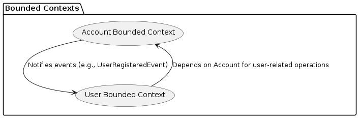
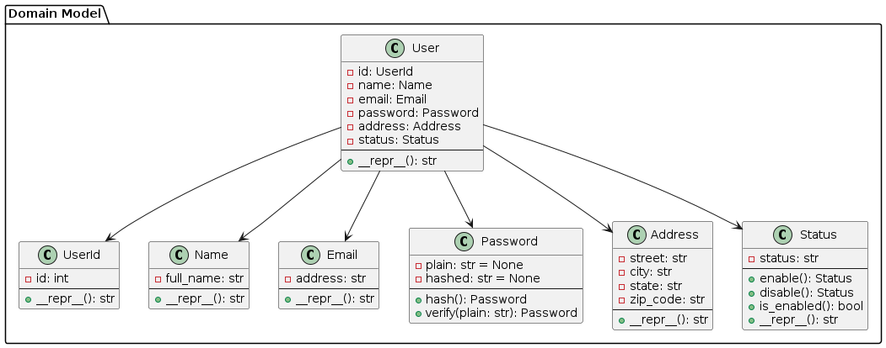
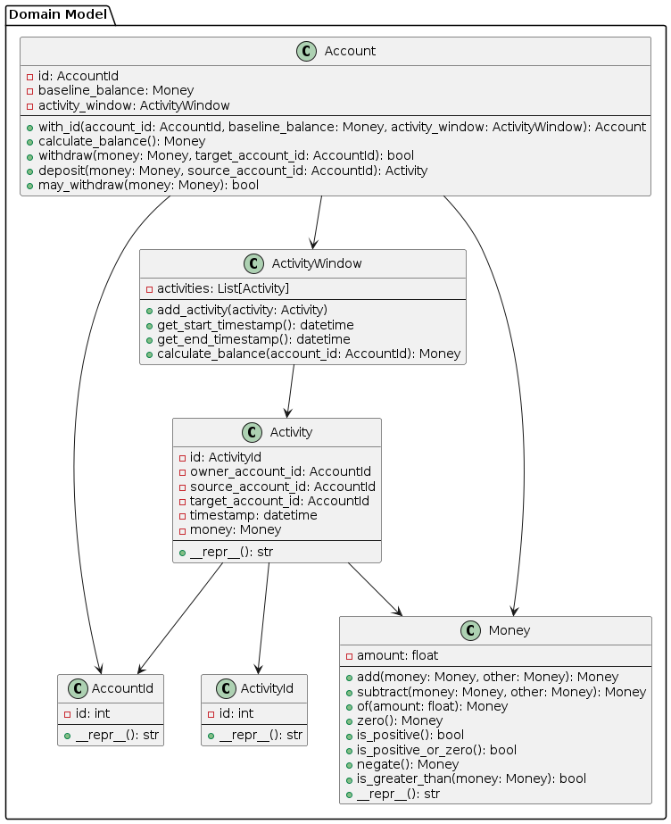

# clean-todo-app

Clean Architecture project following the book "Get your hands dirty on Clean Architecture" by Tom Hombergs.

I'm using a FastApi web adapter and an in-memory repository for persistence.

## Using virtual environment

Create a virtual environment:

    uv venv --python 3.12.6

Activate the virtual environment:

In windows:

    . ./.venv/Scripts/activate

In linux:

    source .venv/bin/activate

## Install the libraries

    uv pip sync requirements.txt

or

    uv pip install .[test]

## Run the application

    uvicorn src.adapter.inbound.web.fastapi:app --reload

## Run the tests

    pytest -v

## Run Docker container

    docker build -t clean-buckpal-app . && docker run -p 8000:8000 --rm --name "clean-buckpal-app" clean-buckpal-app

## Application Design

This mini project aims to demo a small application containing a Clean/Hexagonal Architecture, following Domain Driven Design best practices. The api is build using FastApi. There is not database involved. Values are store in memory only.

### Context

An user can send money to another user. The user must register which create a account with amount 0. When an user send money to another user an activity of this transaction is generate. Users, Accounts and Activities can be display.

### Bounded Contexts

To perform a correct communication between two different bounded context (`User` and `Account`) and aligned with Domain Driven Design, a domain event was created `UserRegisteredEvent`.

### Aggregates

**User Aggregate**

**Account Aggregate**

## REST Api Spec

You can see api documentation [openapi](openapi.yml "REST API Spec").
